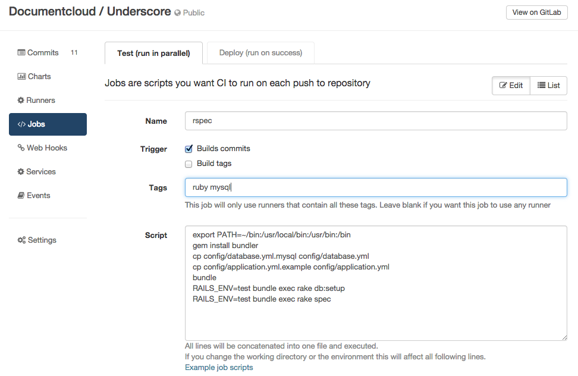
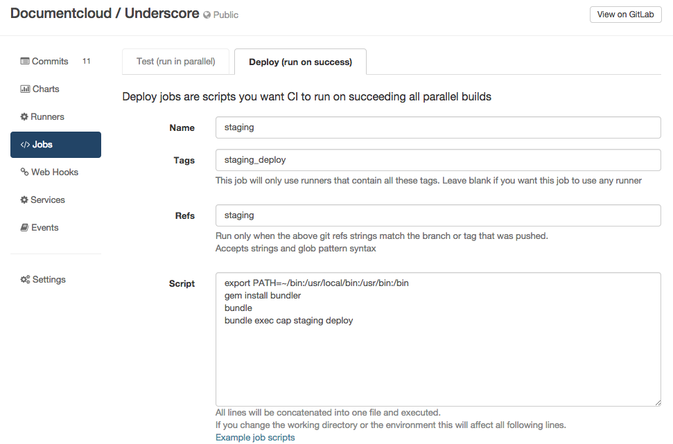

# Jobs

Jobs are user-created shell scripts. On each push to GitLab the CI creates builds for each job.
Every build is served by runners on which the shell scripts from these jobs are ran.
There are two types of jobs: test jobs (ran in parallel) and deploy jobs (ran on success).

### Test job (run in parallel)



These kind of jobs run in parallel and can be useful for test suites.
For example, to save time you can run one part of your test suite in one build
and a second part in another build.

Fields:

`name` - an arbitrary name of a job

`builds commit` (checkbox) - check this if you want to create a build on
pushes of regular commits and branches

`build tag` (checkbox) - check this if you want to start a build on each tag pushed

_For example, for GitLab we created a job for building packages. We want packages to be built when we push
new tags. So what we did is disable `builds commit` and we enabled `build tag`._

`tags` - the list of tags (ex. "ruby mysql silenium"), only runners that contain the same set of tags can perform this build.

Script - your shell script to run. Example for rails projects:

```
export PATH=~/bin:/usr/local/bin:/usr/bin:/bin
gem install bundler
cp config/database.yml.mysql config/database.yml
cp config/application.yml.example config/application.yml
bundle
RAILS_ENV=test bundle exec rake db:setup
RAILS_ENV=test bundle exec rake spec
```


### Deploy jobs (ran on success)



This type of jobs runs after all test jobs pass.
It is especially useful for deploying applications.
For example, if you want to make sure that whole test suite passes before each deploy.

Fields:

`name` - an arbitrary name of the deploy job

`tags` - Just like test jobs, you probably have a specific runner in mind
that can deploy your code, as this runner needs special permissions, for instance.
Here you can set the tags for the runners that are allowed to run the deploy job.

`refs` - Here you can specify git refs that should trigger a deploy job

`script` - The actual shell script to run.
